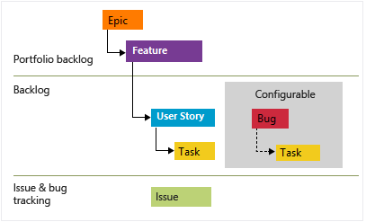

# Cursor rules for Agile

## Motivation

Using modern IDEs with AI capabilities, the software engineer can accelerate the context but in order to help the LLMs, it is a good idea to provide the right context and this set of cursor rules could help in this sense.

Using conversational and a non conversational approach, you could decompose your problems using `Agile` principles in `EPICs`, `Features` & `User Storaes`. With that analysis, you could describe the technical specifications about how to implement using ADR files as the format to describe the functional an non functional requirements and you could finalize the Design phase with some Diagrams in `UML` & `C4 model` related with your documentation. 

[](
https://learn.microsoft.com/en-us/azure/devops/boards/backlogs/define-features-epics?view=azure-devops&tabs=agile-process)

https://learn.microsoft.com/en-us/azure/devops/boards/backlogs/define-features-epics?view=azure-devops&tabs=agile-process

## Cursor Rules

Cursor rules designed to answers the question about **WHAT** the development team is going to build and **WHY** is necessary to build and **WHO** is going to use:

| Phase | Role | Cursor Rule | Description |
|-------|------|-------------|-------------|
| Software requirements gathering | Product Owner | [Create an Agile Epic](.cursor/rules/2001-agile-create-an-epic.mdc) | Define and structure high-level business objectives as epics |
| Software requirements gathering | Product Owner | [Create an Agile Feature](.cursor/rules/2002-agile-create-features-from-epics.mdc) | Break down epics into manageable features |
| Software requirements gathering | Product Owner / Business Analyst | [Create an Agile User Story](.cursor/rules/2003-agile-create-user-story.mdc) | Create detailed user stories from features with acceptance criteria based on Gherkin |

Cursor rules designed to answers the question about **HOW** the team is going to build the requirements and **WHAT** restriction will have the software:

| Phase | Role | Cursor Rule | Description |
|-------|------|-------------|-------------|
| Design | Solution Architect | [UML Sequence Diagram](.cursor/rules/2004-uml-sequence-diagram-about-solution.mdc) | Generate UML sequence diagrams to visualize system interactions |
| Design | Solution Architect | [C4 Model Diagrams](.cursor/rules/2005-c4-diagrams-about-solution.mdc) | Create C4 architecture diagrams for system visualization |
| Requirements | Solution Architect / Technical Lead | [ADR about Functional requirements for CLI Development](.cursor/rules/2006-adr-create-functional-requirements-for-cli-development.mdc) | Create architectural decision records about functional requirements for CLI applications |
| Requirements | Solution Architect / Technical Lead | [ADR about Functional requirements for REST API](.cursor/rules/2006-adr-create-functional-requirements-for-rest-api-development.mdc) | Create architectural decision records about functional requirements for REST API development |
| Requirements | Solution Architect / Technical Lead | [ADR about Acceptance Testing Strategy](.cursor/rules/2007-adr-create-acceptance-testing-strategy.mdc) | Define comprehensive acceptance testing strategies |
| Requirements | Architect / Technical Lead | [ADR about Non-Functional Requirements](.cursor/rules/2008-adr-create-non-functional-requirements-decisions.mdc) | Define non-functional requirements and constraints following *ISO-25010* |
| Requirements | General | [ADR creation using a Conversational approach](.cursor/rules/2300-adr-conversational-assistant.mdc) | Interactive assistant for creating architectural decision records |

Cursor rule designed to implements the requirements:

| Phase | Role | Cursor Rule | Description |
|-------|------|-------------|-------------|
| Implementation | Product Owner / Technical Lead | [Create Task List](.cursor/rules/2100-create-task-list.mdc) | Generate detailed task lists from agile artifacts |
| Implementation | Technical Lead / Senior Software engineer | [Implement Task List](.cursor/rules/2101-implement-task-list.mdc) | Manage and track implementation of generated tasks |
| Refactoring | Technical Lead / Senior Software engineer | [UML Class Diagram Generator](.cursor/rules/2200-uml-class-diagram-mdc) | Generate UML class diagrams for object-oriented design |

## Getting Started

| Phase | Role | Cursor Rule | Description |
|-------|------|-------------|-------------|
| Getting Started | All | [Create Agile Development Checklist](.cursor/rules/2000-agile-checklist.mdc) | Cursor rule designed to help the user to use the whole set of cursor rules for agile in an easy way |

```bash
Create an agile development checklist using the cursor rule @2000-agile-checklist
```

## Examples 

Learn about how to use with some examples [here](https://github.com/jabrena/cursor-rules-examples)

## References

- https://www.cursor.com/
- https://docs.cursor.com/context/rules
- https://docs.cursor.com/context/@-symbols/@-cursor-rules
- https://learn.microsoft.com/en-us/azure/devops/boards/backlogs/define-features-epics?view=azure-devops&tabs=agile-process
- https://gojko.net/books/specification-by-example/
- https://cucumber.io/docs/gherkin/reference
- https://plantuml.com/
- https://www.plantuml.com/plantuml/uml/
- https://c4model.com/abstractions
- https://www.iso25000.com/index.php/en/iso-25000-standards/iso-25010
- ...
- https://github.com/jabrena/cursor-rules-methodology
- https://github.com/jabrena/cursor-rules-agile
- https://github.com/jabrena/cursor-rules-java
- https://github.com/jabrena/cursor-rules-examples
- https://github.com/jabrena/plantuml-to-png-cli
- https://github.com/jabrena/101-cursor
- https://github.com/jabrena/setup-cli
- https://github.com/jabrena/jbang-catalog

