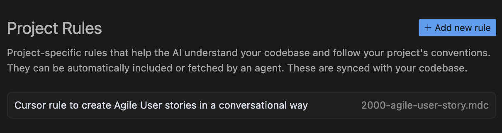

# Cursor rules for Agile

## Motivation

Set of Cursor rules to facilitate Agile in your Squad.

## Rules

- [Agile Epics](.cursor/rules/2001-agile-create-an-epic.mdc)
- [Agile Features](.cursor/rules/2002-agile-create-features-from-epics.mdc)
- [Agile User stories](.cursor/rules/2003-agile-create-user-stories.mdc)
- [UML Sequence Diagram](.cursor/rules/2004-uml-sequence-diagram-from-agile-artifacts.mdc)
- [C4 Model Diagrams](.cursor/rules/2005-c4-diagrams-from-agile-artifacts.mdc)
- [ADRs for CLI Development](.cursor/rules/2006-adr-create-functional-requirements-for-cli-development.mdc)
- [ADRs for REST API](.cursor/rules/2006-adr-create-functional-requirements-for-rest-api.mdc)
- [ADRs for Acceptance Testing Strategy](.cursor/rules/2007-adr-create-acceptance-testing-strategy.mdc)
- [ADRs for Non-Functional Requirements](.cursor/rules/2008-adr-create-non-functional-requirements-decisions.mdc)

## Prompts

Learn to use the Cursor rules [here](./prompts/README.md).

## References

- https://www.cursor.com/
- https://docs.cursor.com/context/rules
- https://docs.cursor.com/context/@-symbols/@-cursor-rules
- https://forum.cursor.com/t/optimal-structure-for-mdc-rules-files/52260/12
- https://gojko.net/books/specification-by-example/
- https://gojko.net/lists/specification-by-example.html
- https://gasparnagy.com/media/resources/20140611-AgiliaBudapest-GasparNagy-slides.pdf
- https://cucumber.io/docs/gherkin/reference
- https://www.plantuml.com/plantuml/uml/
- https://c4model.com/abstractions
- https://www.iso25000.com/index.php/en/iso-25000-standards/iso-25010
- ...
- https://github.com/jabrena/cursor-rules-methodology
- https://github.com/jabrena/cursor-rules-agile
- https://github.com/jabrena/cursor-rules-tasks
- https://github.com/jabrena/cursor-rules-java
- https://github.com/jabrena/cursor-rules-examples
- https://github.com/jabrena/101-cursor
- https://github.com/jabrena/setup-cli
- https://github.com/jabrena/jbang-catalog

